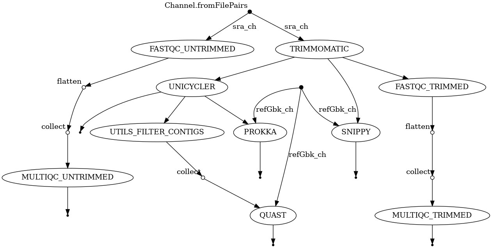

# camila_sao_paulo nextflow pipeline
A pipeline for Genome Assembly, Genome Anotation and Variant Calling with quality evaluation, using .fastq files and a reference genome as input.

## Requirements

* Nextflow VERSION > 20.11
* Java 8
* Docker

## Pipeline workflow



This is the complete workflow of this pipeline, the tool integration aims on a good quality evaluation of all process, 

## Quick start

### Local execution
1. Install nextflow 

	Please refer to [Nextflow page on github](https://github.com/nextflow-io/nextflow/) for more info.

2. Clone this repo

```
	git clone https://github.com/bioinformatics-lab/camila_sao_paulo_nf.git

```

3. Run it!


```
	nextflow run main.nf --reads $READ --gbkFile $GBK --outdir $OUTDIR

```

$READ = STR, replace for your reads location. You can write using READ_{1,2}.fastq.gz or READ_1.fastq.gz READ_2.fastq.gz 

$GBK = STR, replace for your reference gbk lcation.

$OUDIR = STR, replace for the name of your desired output directory.

## Configuration Profiles.

You can use diferent profiles for this pipeline, based on the computation enviroment at your disposal. Here are the Avaliable Profiles:

* aws 

* azure

* gcp

## Tower execution
This Pipeline can be launched on `Tower`, please refer to [Tower launch documentation](https://help.tower.nf/docs/launch/overview/) for step-by-step execution tutorial.

When launching from `Tower`, please update and use the `params.yml` file contents.

## stub-run
This project has the `-stub-run` feature, that can be used for testing propouse, it can be used on `Tower` with the Advanced settings on launch. You can also test it locally, using the following command:

```
bash data/mock_data/generate_mock_data.sh
nextflow run main.nf \
		 -params-file stub_params.yaml \
		 -stub-run
``` 

## Project structure

├── bin
│   └── filter_contigs.pl
├── data
│   └── mock_data
│       └── generate_mock_data.sh
├── LICENSE
├── main.nf
├── modules
│   ├── fastqc
│   │   └── fastqc.nf
│   ├── multiqc
│   │   └── multiqc.nf
│   ├── prokka
│   │   └── prokka.nf
│   ├── quast
│   │   └── quast.nf
│   ├── snippy
│   │   └── snippy.nf
│   ├── spades
│   │   └── spades.nf
│   ├── trimmomatic
│   │   └── trimmomatic.nf
│   ├── unicycler
│   │   └── unicycler.nf
│   └── utils
│       └── filter_contigs
│           └── filter_contigs.nf
├── nextflow.config
├── params
│   ├── local.yml
│   ├── stub_params.yaml
│   └── test_params.yml
├── README.md
├── resources
│   ├── dag.dot
│   ├── dag.png
│   └── Tortoli_1-s2.0-S1567134819302011-mmc2.csv
├── Taskfile.yml
└── workflows
    └── download_references
        └── download_fasta_references.nf
